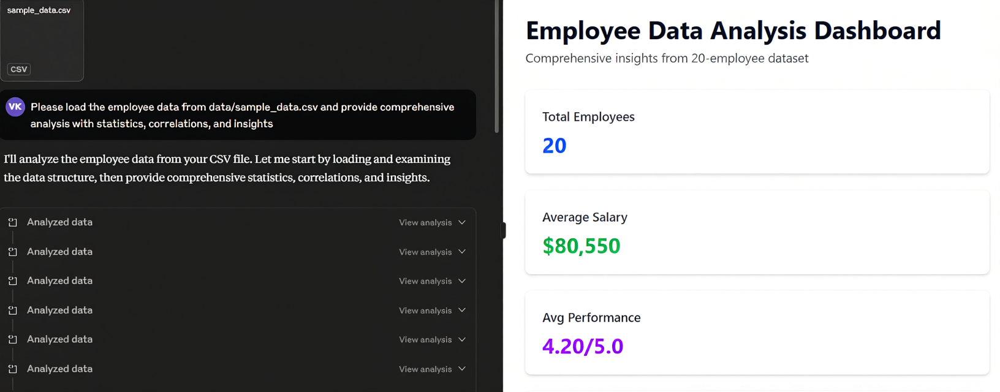
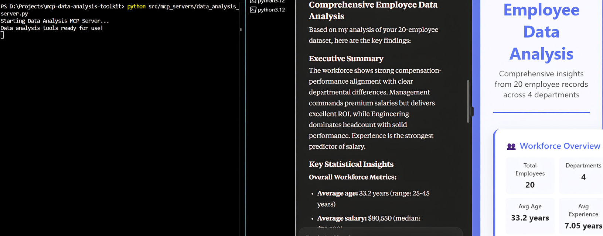
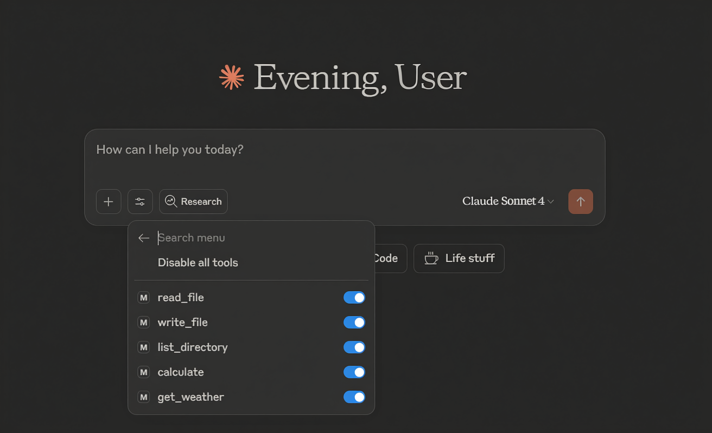

# 🚀 MCP Data Analysis Toolkit

[](https://www.python.org/downloads/)
[](https://opensource.org/licenses/MIT)
[](https://modelcontextprotocol.io/)
[](https://claude.ai/download)
[](https://github.com/And3m/mcp-data-analysis-toolkit/stargazers)
[](https://github.com/And3m/mcp-data-analysis-toolkit/network)
[](https://github.com/And3m/mcp-data-analysis-toolkit/issues)

**Production-ready MCP (Model Context Protocol) toolkit designed for data analysts and AI enthusiasts.** Transform complex datasets into compelling insights with AI-powered analysis workflows.

**Created by [Vijay Andem](https://www.linkedin.com/in/vijay-andem-b2092223/)** - Data Analyst passionate about transforming complex datasets into compelling visual stories, specializing in Power BI, Tableau, and Streamlit dashboard development.

## 🌟 What Makes This Special

- **🎯 Data Analyst Focused**: Built specifically for Power BI, Tableau, and Streamlit workflows
- **🏭 Production Ready**: Enterprise-grade code with comprehensive testing and documentation
- **🖥️ Claude Desktop Integration**: Seamless AI-powered data analysis experience
- **📊 Business Intelligence Ready**: Tools designed for real-world BI scenarios
- **⚡ Modern Architecture**: Clean, scalable Python implementation with async patterns
- **🧪 Fully Tested**: Comprehensive test suite with CI/CD pipeline

## 🏗️ Project Structure

```
mcp-data-analysis-toolkit/
├── 📁 assets/                       # 🖼️ Screenshots and media files
│   ├── screenshots/                 # Claude Desktop demos, workflows  
│   └── diagrams/                   # Architecture diagrams
├── 📁 src/                          # 🔧 Core source code
│   ├── mcp_servers/                 # MCP server implementations
│   │   ├── basic_server.py          # 🎓 Learning-focused basic tools
│   │   ├── advanced_server.py       # 🛠️ File operations & processing
│   │   └── data_analysis_server.py  # 📊 Comprehensive data analysis
│   └── clients/                     # MCP client implementations
│       └── client_example.py        # 🚀 Full-featured client demo
├── 📁 docs/                         # 📚 Comprehensive documentation
│   ├── setup/                      # Setup and configuration guides
│   │   ├── getting-started.md      # 🚀 Complete setup guide
│   │   ├── claude-desktop-setup.md  # 🖥️ Claude Desktop integration
│   │   └── github-publication.md   # 📢 Publication guide
│   └── api/                        # Technical documentation
│       ├── api-reference.md        # 📖 Complete API documentation
│       └── examples.md             # 💡 Real-world usage examples
├── 📁 examples/                     # 🎮 Demo scripts and tutorials
│   └── demo.py                     # Interactive demonstration
├── 📁 tests/                       # 🧪 Comprehensive test suite
├── 📁 data/                        # 📋 Sample datasets
├── 📁 config/                      # ⚙️ Server configurations
├── 📁 .github/workflows/           # 🔄 CI/CD automation
└── 📄 Essential files (README, LICENSE, requirements, etc.)
```

## 🚀 Quick Start

### 1. Installation
```bash
# Clone the repository
git clone https://github.com/And3m/mcp-data-analysis-toolkit.git
cd mcp-data-analysis-toolkit

# Create virtual environment (recommended)
python -m venv mcp-env
# Windows
mcp-env\Scripts\activate
# macOS/Linux
source mcp-env/bin/activate

# Install dependencies
pip install -r requirements.txt
```

### 2. Run the Demo
```bash
# Interactive demonstration of all features
python examples/demo.py
```

### 3. Test Everything
```bash
# Comprehensive test suite
python tests/test_mcp.py
```

### 4. Try Data Analysis
```bash
# Start the data analysis server
python src/mcp_servers/data_analysis_server.py

# In another terminal, run the client
python src/clients/client_example.py data
```

### 5. Interactive Mode
```bash
# Full interactive experience
python src/clients/client_example.py interactive
```

### 6. Production Setup
```bash
# Install as package
pip install -e .

# Run installed commands
mcp-data-analysis-server
mcp-basic-server
mcp-client-demo
```

## 🔧 MCP Servers Included

### 🏫 Basic Server (`src/mcp_servers/basic_server.py`)
**Perfect for learning MCP fundamentals**
- 🧮 Calculator with mathematical expressions
- 🔤 String manipulation utilities
- ⏰ Date/time functions
- 📊 System information resources
- 📝 AI interaction prompts

### 🛠️ Advanced Server (`src/mcp_servers/advanced_server.py`)
**File operations and enhanced processing**
- 📂 File read/write operations
- 📁 Directory listing and management
- 📊 CSV data analysis (with pandas)
- 📋 Temporary workspace management
- 🔒 Safe file access controls

### 📊 Data Analysis Server (`src/mcp_servers/data_analysis_server.py`)
**Comprehensive business intelligence toolkit**
- 📥 Dataset loading (CSV, JSON)
- 📊 Statistical analysis and summaries
- 🔗 Correlation discovery
- 📝 Data quality assessment
- 🔍 Automated insights generation
- 📋 Group analysis and segmentation
- 🎨 Perfect for Power BI/Tableau prep work

## 🖥️ Claude Desktop Integration

> **🎯 Transform Claude Desktop into your Personal Data Analysis Assistant!**

### 📸 **Screenshots Gallery**

| **🤖 AI-Powered Analysis** | **📊 Complete Workflow** | **⚙️ Simple Configuration** |
|:-------------------------:|:------------------------:|:----------------------------:|
|  |  |  |
| **Natural Language Data Analysis**<br>*Ask Claude to analyze your data using simple English* | **Automated Statistical Processing**<br>*From raw data to insights in minutes* | **Easy Setup Process**<br>*Configure once, analyze forever* |

### 🚀 **See It In Action**

**1. 🤖 Claude Desktop Demo**
```
User: "Analyze the sales data and show me department performance"
Claude: *Automatically loads data, calculates statistics, finds correlations, and provides insights*
```

**2. 📊 Complete Workflow**
- ✅ Load datasets instantly
- 🔍 Automated data quality checks
- 📈 Statistical summaries
- 🎯 Correlation analysis
- 💡 AI-generated insights

**3. ⚙️ Simple Setup**
- 📋 Copy configuration template
- ✏️ Update your project path
- 🔄 Restart Claude Desktop
- 🚀 Start analyzing immediately!

---

### 🛠️ **Quick Claude Desktop Setup**

#### 🚀 **3-Step Installation**

```bash
# 1️⃣ Clone and Setup
git clone https://github.com/And3m/mcp-data-analysis-toolkit.git
cd mcp-data-analysis-toolkit
pip install -r requirements.txt

# 2️⃣ Configure Claude Desktop
# Copy claude_desktop_config.json to Claude's config directory
# Update YOUR_PROJECT_PATH with your installation path

# 3️⃣ Restart Claude Desktop and start analyzing!
```

#### 💬 **Example Analysis Request**
```
"Please load the employee data from data/sample_data.csv and provide:
• Comprehensive statistical summary
• Correlation analysis between salary and performance
• Department-wise performance insights
• Data quality assessment
• Recommendations for dashboard creation"
```

**📁 Detailed Setup Guide**: [Claude Desktop Integration](docs/setup/claude-desktop-setup.md)

## 🎯 Perfect For

### 📊 Data Analysts & BI Professionals
- **Power BI Integration**: Validate and prepare data for dashboards
- **Tableau Workflows**: Statistical analysis and data profiling
- **Streamlit Development**: Backend data processing and insights
- **Business Intelligence**: Automated reporting and analysis

### 👨‍💻 Developers & Engineers
- **AI Integration**: Learn cutting-edge MCP protocol
- **Tool Building**: Create custom AI-accessible tools
- **Automation**: Build AI-powered workflows
- **Production Deployment**: Enterprise-ready patterns and practices

### 🚀 AI Enthusiasts & Researchers
- **Hands-on Learning**: Practical MCP implementation
- **Research Applications**: Extend for custom research needs
- **Community Building**: Contribute to growing MCP ecosystem
- **Innovation**: Build next-generation AI applications

## 📱 Social Media & Updates

**Follow the creator:**
- 💼 **LinkedIn**: [Vijay Andem](https://www.linkedin.com/in/vijay-andem-b2092223/) - Professional insights and data analysis content
- 🐦 **X/Twitter**: [@vjandem](https://x.com/vjandem) - Quick tips, updates, and educational content

*Stay updated with the latest developments in AI-powered data analysis!*

## 🏆 Recognition

This project demonstrates:
- **Advanced Python Development** with modern async patterns
- **AI Protocol Implementation** using cutting-edge MCP standard
- **Data Analysis Automation** for business intelligence
- **Production-Ready Code** with comprehensive testing and documentation

## 🤝 Contributing

We welcome contributions! Here's how to get involved:

1. **Fork** the repository
2. **Create** a feature branch (`git checkout -b feature/amazing-feature`)
3. **Commit** your changes (`git commit -m 'Add amazing feature'`)
4. **Push** to the branch (`git push origin feature/amazing-feature`)
5. **Open** a Pull Request

### 🎯 Areas for Contribution
- Additional MCP server examples
- Integration with other AI platforms
- Enhanced data analysis tools
- Documentation improvements
- Performance optimizations

## 📜 License

This project is licensed under the **MIT License** - see the [LICENSE](LICENSE) file for details.

## 🙏 Acknowledgments

- **Anthropic** for creating the MCP standard
- **Python Community** for excellent libraries and tools
- **Data Analysis Community** for inspiration and feedback
- **Contributors** who help improve this project

---

**⭐ If this project helps you, please give it a star! It helps others discover this resource.**

*Built with ❤️ for the data analysis and AI community*